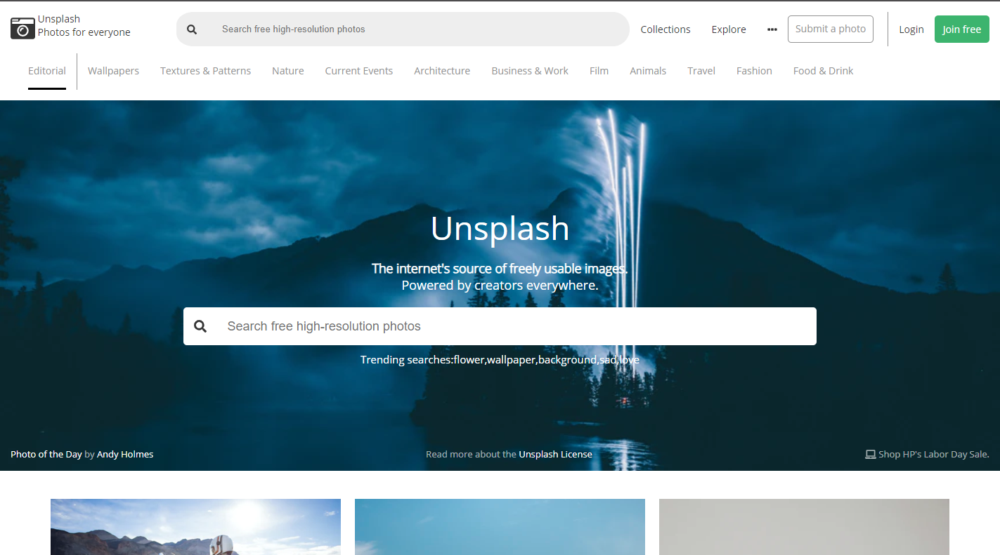

# Design your own Grid-based Framework

> The goal of this project is build a grid based framework including the basic functionalities to build a website.

You can find the original description in [The Odin Project](https://www.theodinproject.com/courses/html5-and-css3/lessons/design-your-own-grid-based-framework)

## Built With

- CSS3

## Live Demo

[Live version](https://rawcdn.githack.com/bruna-genz/unsplash-clone/81f9bb9b837b4dd78dc701ec332c15a17b626d6f/index.html) of a clone from [Unsplash](https://unsplash.com/) homepage, which was built with the goal of testing this framework.

## Getting Started

> To get a local copy up and running follow these simple example steps.

### Prerequisites

- `Git`

### Setup

To clone the project in your local environment do the following.

- Open a new `terminal` window and navigate to the directory where the project will be stored.
- Run the command `git clone git@github.com:oscardelalanza/Grid-framework.git`.
- Run the command `cd Grid-framework` to enter the project directory.

### Usage

Add the different `css classes` to your `html elements` as you need it. 

- Use the `p` classes to generate `paddings`.
- Use the `m` classes to generate `margins`.
- Use the `col` classes to separate in `columns` the screen.
- Use the `md` and `sm` to switch between the different screen breakpoints.

### Install

- Copy and paste the `css` folder  and the `Open_Sans` folder with all his content into the `root` of your project.
- Link the `framework.css` file to your `html files`.

## Authors

👤 **Bruna Genz**

- Github: [@bruna-genz](https://github.com/bruna-genz)
- Twitter: [@Bruna_GK](https://twitter.com/Bruna_GK)
- Linkedin: [Bruna Genz](https://www.linkedin.com/in/brunagenz/)

👤 **Oscar De La Lanza**

- Github: [@oscardelalanza](https://github.com/oscardelalanza)
- Twitter: [@oscardelalanza](https://twitter.com/oscardelalanza)
- Linkedin: [Oscar De La Lanza](https://linkedin.com/in/oscardelalanza)
- Email: oscardelalanza@gmail.com

## 🤝 Contributing

Contributions, issues and feature requests are welcome!

## Show your support

Give a ⭐️ if you like this project!
